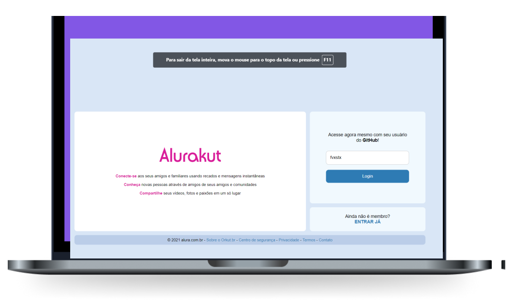

<h1 align="center">
    
</h1>

  <a href="#-acesso">Acesso</a>&nbsp;&nbsp;&nbsp;|&nbsp;&nbsp;&nbsp;
  <a href="#-tecnologias">Tecnologias</a>&nbsp;&nbsp;&nbsp;|&nbsp;&nbsp;&nbsp;
  <a href="#-projeto">Projeto</a>&nbsp;&nbsp;&nbsp;|&nbsp;&nbsp;&nbsp;
  <a href="#-layout">Layout</a>&nbsp;&nbsp;&nbsp;|&nbsp;&nbsp;&nbsp;
  <a href="#memo-licença">Licença</a>&nbsp;&nbsp;&nbsp;|&nbsp;&nbsp;&nbsp;
  <a href="#-comandos">Comandos</a>

 

  

## 😁 Acesso

Acesse e veja você mesmo: https://alurakut-eight-pi.vercel.app/login

## 🚀 Tecnologias

Esse projeto foi desenvolvido com as seguintes tecnologias:

- [Node.js](https://nodejs.org/en/)
- [React.js](https://reactjs.org/)
- [Next.js](https://nextjs.org/)
- [Babel](https://babeljs.io/)

## 💻 Projeto

O Alurakut é uma rede social inspirada no antigo Orkut para relembrar seus usos

## 🔖 Layout

Você pode visualizar o layout do projeto através [desse link](https://www.figma.com/file/xHF0n0qxiE2rqjqAILiBUB/Alurakut?node-id=58%3A0). Lembrando que você precisa ter uma conta no [Figma](http://figma.com/) para acessá-lo.

## :memo: Licença

Esse projeto está sob a licença MIT. Veja o arquivo [LICENSE](LICENSE.md) para mais detalhes.

## 🧮 Comandos

Para iniciar o projeto em modo desenvolvedor você utiliza o comando

### `yarn dev`

Abre o projeto nesse link [http://localhost:3000](http://localhost:3000) para ver no seu browers.

Está pagina reinicia a cada mudança feita

### `yarn build`

Cria uma versão da sua aplicação otimizada para modo produção

### `yarn start`

Inicia o projeto em modo produção

---
